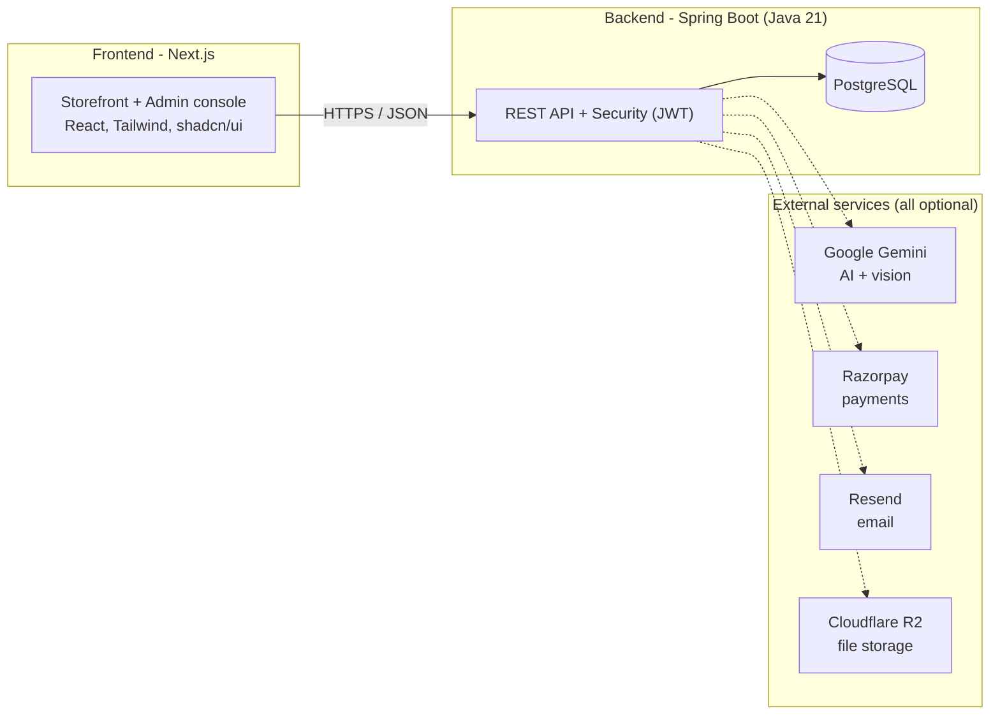

# 🌿 EcoExpress

**An AI-powered online store for certified-organic groceries, built for India.**

EcoExpress is a full online grocery shop — like BigBasket or Blinkit, but focused on **organic food** and with **artificial intelligence built into the shopping experience**. Customers can browse fresh organic produce, see proof that it's genuinely certified organic, get AI help planning meals and using up what's in their fridge, and check out with real online payments.

> 🔗 **Live demo:** [ecoexpress-nu.vercel.app](https://ecoexpress-nu.vercel.app)
> On the login page, click **"As User"** or **"As Admin"** to try it instantly — no signup needed.

---

## 📖 What is this, in plain English?

Imagine a normal grocery website. Now add a few things most grocery sites *don't* have:

- **Trust you can verify.** Every "organic" product can show its actual certificate (like an NPOP/India Organic document), so you're not just taking the shop's word for it.
- **A nutrition score for your basket.** As you add items, the app rates how healthy your overall cart is — like a nutrition label for your whole shop.
- **AI that helps you cook and waste less food.**
  - *Smart Fridge:* take a photo of your fridge, and the app spots the ingredients and offers to restock what's missing.
  - *Meal Planner:* get a week of meal ideas.
  - *Recipe from your cart:* it looks at what you've added (say, spinach + paneer) and suggests a dish you can make (Palak Paneer) — then lets you add the missing ingredients in one tap.
  - *Pantry:* track what you have at home and get a reminder before food expires.
- **The real shop machinery too:** search, categories, reviews, multiple delivery addresses, online card payments, order tracking, emailed receipts and PDF invoices, and a full staff/admin dashboard to manage products, stock, orders and more.

It's a complete, working e-commerce product — not a demo or a tutorial project.

---

## ✨ Key features

| Area | What it does |
|---|---|
| 🛒 **Storefront** | Browse & search organic products, categories, product pages with images, reviews, and nutrition facts |
| 🧾 **Organic trust** | Products carry verifiable organic certificates (the core differentiator) |
| 🥗 **Smart Cart** | Live nutrition score for your whole basket as you shop |
| 🤖 **AI Smart Fridge** | Photo of your fridge → detected ingredients → restock suggestions |
| 🍳 **AI Meal Planner & Recipes** | Weekly meal plans; turn your cart into a cookable dish |
| 🧊 **Pantry** | Track what you own; auto-stocked on delivery; expiry reminders by email |
| 🔔 **Back-in-stock alerts** | "Notify me" on out-of-stock items; auto-emailed when they return |
| 💳 **Payments** | Real online payments via Razorpay (test mode in the demo) |
| 📦 **Orders** | Cart, Buy Now, checkout, order tracking, cancellations, PDF invoices |
| 👤 **Accounts** | Profile, secure email change, multiple saved addresses, Google sign-in |
| 🛠️ **Admin console** | Products, inventory, purchase orders, coupons, banners, orders, AI-spend dashboard, review moderation |
| 📱 **Mobile-ready** | Fully responsive — works on phones, tablets and desktops |

---

## 🧱 How it's built (for the technical reader)

EcoExpress is split into two applications that talk over a REST API:



**Stack at a glance**

| Layer | Technology |
|---|---|
| **Frontend** | Next.js 14 (App Router), TypeScript, Tailwind CSS, shadcn/ui, TanStack Query |
| **Backend** | Java 21, Spring Boot 3.3, Spring Security (JWT), Flyway migrations |
| **Database** | PostgreSQL |
| **AI** | Google Gemini (text + vision), via a swappable provider interface |
| **Payments / Email / Storage** | Razorpay · Resend · Cloudflare R2 (each behind an interface, each optional) |
| **Deployment** | Backend on Render, Frontend on Vercel, Database on Neon |

A guiding principle: **every external service is optional and behind an interface.** With no AI/payment/email keys configured, those features simply switch off gracefully (returning a clean "unavailable" response) — so you can run the whole app locally with nothing but a database.

---

## 🚀 Getting started

**Want to run it on your own machine?** → See **[SETUP.md](SETUP.md)** for a complete, step-by-step guide (prerequisites, configuration, and running both apps).

**Want to deploy it to the cloud?** → See **[DEPLOY.md](DEPLOY.md)**.

The short version:

```bash
# 1. Backend  (needs Java 21 + a PostgreSQL database)
cd server
mvn spring-boot:run          # -> http://localhost:8081

# 2. Frontend (needs Node.js 20)
cd client
npm install
npm run dev                  # -> http://localhost:3000
```

Then open **http://localhost:3000** and use the one-click demo login.

---

## 📚 Project documentation

| Document | What's inside |
|---|---|
| **[SETUP.md](SETUP.md)** | Run the project locally, step by step |
| **[DEPLOY.md](DEPLOY.md)** | Deploy to Render + Vercel |
| **[docs/ERD.md](docs/ERD.md)** | Database schema / entity relationships |
| **[docs/INTERVIEW.md](docs/INTERVIEW.md)** | Deep engineering write-up & design decisions |

---

## 📂 Repository layout

```
ecom-exp/
├── server/       # Spring Boot backend (Java) - the API, database, business logic
│   └── src/main/java/com/ecoexpress/
│       ├── catalog/      # products, categories, variants
│       ├── inventory/    # stock, warehouses, purchase orders
│       ├── order/        # cart, checkout, orders
│       ├── payment/      # Razorpay integration
│       ├── ai/           # Gemini features (fridge scan, meal plan, recipes)
│       ├── engagement/   # notifications, reviews, back-in-stock alerts
│       └── identity/     # users, auth, roles
├── client/       # Next.js frontend (TypeScript) - the website & admin console
│   └── src/
│       ├── app/          # pages (App Router)
│       ├── components/   # UI components
│       ├── hooks/        # data-fetching hooks
│       └── api/          # backend API client
└── docs/         # additional documentation
```

---

## 👤 Author

Built by **Yogesh**. A solo-built, spec-driven (PRD) startup product.
